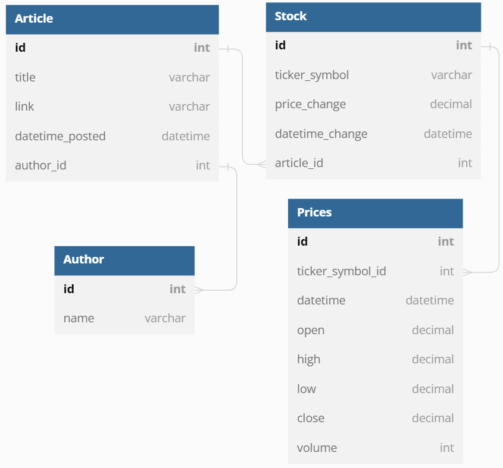

# SeekingAlpha Web Scraping Project


This is a Python project that web scraps data about latest news from financial
news website [seekingalpha.com].

## Features

Collects data about latest financial news and their impact
on current stock prices. Article data being collected:
- article titles
- link to each article
- article id on the site
- stock price change
- date and time of stock price change measurement
- stock ticker symbol
- date and time of article being posted
- article's author

Also can to collect data from [alphavantage.co] API.

## Installation and usage

Install [python 3](https://www.python.org/downloads/) and
then the required python packages:

```sh
pip install -r requirements.txt
```

If you don't use Google Chrome, then [install it](https://www.google.com/chrome/).

[Find](https://stackoverflow.com/questions/49788257/what-is-default-location-of-chromedriver-and-for-installing-chrome-on-windows)
(that can be hard) or [download](https://sites.google.com/chromium.org/driver/downloads)
(that should be easier) Google Chrome driver corresponding to you Chrome browser
[version](https://help.illinoisstate.edu/technology/support-topics/device-support/software/web-browsers/what-version-of-chrome-do-i-have).

Put the path to your Google Chrome driver into a `CHROME_DRIVER_PATH` variable of `conf.json` file like this:
```json
{
 "CHROME_DRIVER_PATH": "C:\\Users\\maxim\\PycharmProjects\\chromedriver_win32\\chromedriver.exe"
}
```

It is also highly recommended to set your Google Chrome browser settings to insecure mode:
* in the upper right corner click the Menu button ⋮
* choose Settings
* go to Privacy and security
* click Site Settings
* scroll down until you see the Content section
* in the Content section:
  * select Cookies and other site data, then choose Allow all cookies.
  * select JavaScript, then choose Sites can use Javascript
* go back to Settings
* find Security >> no protection, and disable ad blockers

If you want to get data from [alphavantage.co] API, then you need to register there,
get an API key and paste it into "API_KEY" field of `conf.json` file like this
(the example is not a real API key!). 

```json
{
  "API_KEY": "NWB5X0AG8IO1BL7U"
}
```

The data requested from [alphavantage.co] will be saved in a database table 'prices'.

Make sure your local MySQL server is turned on and then configure
(just open and review) the `conf.json` and `mysql_connector.json`
files and finally run

```sh
pyhton3 main.py
```

## Settings

You can change various program setting before execution by editing
config files `conf.json` and `mysql_connector.json` or by providing
CLI commands.

Here is the explanation of the variables and CLI commands.

### conf.json file

It is the file of general program setting. Here is an example:

```json
{
    "DEBUG_LOG_LEVEL": 20,
    "DEPLOYMENT_LOG_LEVEL": 20,
    "DEBUG_MODE": true,
    "URL": "https://seekingalpha.com/market-news?page=",
    "DEPLOYMENT_NUMBER_OF_PAGES": 2,
    "DEBUG_NUMBER_OF_PAGES": 1,
    "DEBUG_NUMBER_OF_URLS": 5,
    "PARALLEL": false,
    "CHROME_DRIVER_PATH": "C:\\Users\\maxim\\PycharmProjects\\chromedriver_win32\\chromedriver.exe",
    "MYSQL_CONFIG_FILE": "mysql_connector.json",
    "SECONDARY_PAGES_SCRAPPING": false,
    "REQUEST_API_DATA": true,
    "API_KEY": "NWB5X0AG8IO1BL7U",
    "API_BASE_URL": "https://www.alphavantage.co/query?",
    "API_DATA_INTERVAL": "5min",
    "//00_comment": "Logging_levels:",
    "//01_comment": "DEBUG=10",
    "//02_comment": "INFO=20",
    "//03_comment": "WARN=30",
    "//04_comment": "ERROR=40",
    "//05_comment": "CRITICAL=50."
}
```

* `"DEBUG_MODE"` is the switcher between debug and deployment program scenatious.
* `"DEBUG_LOG_LEVEL"` and `"DEPLOYMENT_LOG_LEVEL"` - the levels
of logging in corresponding scenarios.
* `"DEBUG_NUMBER_OF_PAGES"` and `"DEPLOYMENT_NUMBER_OF_PAGES"` - the number
of main pages to scrap in corresponding scenarios.
* `"DEBUG_NUMBER_OF_URLS"` is the number of news articles to scrap and show.
Used only in debug mode.
* `"URL"` - the link to first news page of seekingalpha.com 
* `"PARALLEL"` - the switcher to parallel approach of web scraping.
* Temporarily out of order due to site security upgrade.
* `"CHROME_DRIVER_PATH"` - path to your Google Chrome driver for selenium to use
* `"MYSQL_CONFIG_FILE"` - path to your `mysql_connector.json` config file
(described in the next section)
* `"SECONDARY_PAGES_SCRAPPING"` - switcher to scrap or not to scrap secondary pages
(it takes time for actually no reason)
* `"REQUEST_API_DATA"` - switcher to get or not to get API data about stocks.
* `"API_KEY"` - your API key for [alphavantage.co]
* `"API_BASE_URL"` - base url of API query, no need to change it until it works
* `"API_DATA_INTERVAL"` - interval between historical API data samples

And the rest is just a note on debug levels for user comfort.

The program will not run without any of these values even if you are not about to use debug mode
or API data or if you want to use command line arguments, so please fill anything in each
of variables saving their datatypes. 

### mysql_connector.json file

This is the file of database settings. Here is an example:

```json
{
  "USER_NAME": "root",
  "PASSWORD": "root",
  "COMMAND_1": "DROP DATABASE IF EXISTS market;",
  "COMMAND_2": "CREATE DATABASE IF NOT EXISTS market;", 
  "COMMAND_3": "DROP TABLE IF EXISTS stock;",
  "COMMAND_4": "DROP TABLE IF EXISTS article;",
  "COMMAND_5": "DROP TABLE IF EXISTS author;",
  "COMMAND_6": "CREATE TABLE IF NOT EXISTS author (id INT AUTO_INCREMENT PRIMARY KEY, name VARCHAR(255));",
  "COMMAND_7": "CREATE TABLE IF NOT EXISTS article (id INT AUTO_INCREMENT PRIMARY KEY, title VARCHAR(1000), link VARCHAR(1000), datetime_posted DATETIME, author_id INT, FOREIGN KEY (author_id) REFERENCES author(id));",
  "COMMAND_8": "CREATE TABLE IF NOT EXISTS stock (id INT AUTO_INCREMENT PRIMARY KEY, ticker_symbol VARCHAR(50), price_change DECIMAL(10, 2), datetime_change DATETIME, article_id INT, FOREIGN KEY (article_id) REFERENCES article(id));",
  "COMMAND_9": "DROP TABLE IF EXISTS prices;",
  "COMMAND_10": "CREATE TABLE IF NOT EXISTS prices (id INT AUTO_INCREMENT PRIMARY KEY, ticker_symbol_id INT, datetime DATETIME, open DECIMAL(10,4), high DECIMAL(10,4), low DECIMAL(10,4), close DECIMAL(10,4), volume INT, FOREIGN KEY (ticker_symbol_id) REFERENCES stock(id));"
}
```

Username, passwords and command to execute.
The commands will be executed one-by-one in a loop.
It's recommended to keep their naming style and order.

### CLI arguments

User can also provide some CLI arguments.
Most of them replace the ones provided in the `conf.json` file.

Here is the help message.

```sh
usage: main.py [-h] [-c CONFIG_FILE] [-l LOG_FILE]
               [--debug-log-level {10,20,30,40,50}]
               [--deployment-log-level {10,20,30,40,50}] [-d DEBUG_MODE]
               [--url URL] [--chrome-driver-path CHROME_DRIVER_PATH]
               [--mysql-config-file MYSQL_CONFIG_FILE] [--api-key API_KEY]
               [--api-base-url API_BASE_URL]
               [--api-data-interval API_DATA_INTERVAL]
               [--request-api-data REQUEST_API_DATA]
               [--secondary-pages-scrapping SECONDARY_PAGES_SCRAPPING]
               [--debug_number-of-pages DEBUG_NUMBER_OF_PAGES]
               [--deployment-number-of-pages DEPLOYMENT_NUMBER_OF_PAGES]
               [--debug-number-of-urls DEBUG_NUMBER_OF_URLS] [-p]

Scrap info from "seeking alpha" site and alphavantage.co API

options:
  -h, --help            show this help message and exit
  -c CONFIG_FILE, --config-file CONFIG_FILE
                        Path to the .json config file to use
  -l LOG_FILE, --log-file LOG_FILE
                        Name of log file
  --debug-log-level {10,20,30,40,50}
                        Log level in debug mode, integer. Possible choices: *
                        DEBUG=10 * INFO=20 * WARN=30 * ERROR=40 * CRITICAL=50
  --deployment-log-level {10,20,30,40,50}
                        Log level in deployment mode, integer. Possible
                        choices: * DEBUG=10 * INFO=20 * WARN=30 * ERROR=40 *
                        CRITICAL=50
  -d DEBUG_MODE, --debug-mode DEBUG_MODE
                        Switcher between dev (debug) and prod (deployment)
                        scenarios.
  --url URL             URL of the main news page. Must ends with '?page='
  --chrome-driver-path CHROME_DRIVER_PATH
                        Path to Google Chrome driver file.
  --mysql-config-file MYSQL_CONFIG_FILE
                        Path to mysql configuration file containing SQL
                        commands and your login and password.
  --api-key API_KEY     API key to request data from alphavantage.co
  --api-base-url API_BASE_URL
                        Exact base url of api to request data from
                        alphavantage.co
  --api-data-interval API_DATA_INTERVAL
                        Interval between stock states requested from
                        alphavantage.co
  --request-api-data REQUEST_API_DATA
                        Switcher between modes that enable to requestdata from
                        alphavantage.co.
  --secondary-pages-scrapping SECONDARY_PAGES_SCRAPPING
                        Switcher between modes that enable not to
                        scrapsecondary pages of each article.
  --debug_number-of-pages DEBUG_NUMBER_OF_PAGES
                        Number of news main pages to scrap in debug mode
  --deployment-number-of-pages DEPLOYMENT_NUMBER_OF_PAGES
                        Number of news main pages to scrap in deployment mode
  --debug-number-of-urls DEBUG_NUMBER_OF_URLS
                        Number of articles to save and show in debug mode(used
                        only in debug mode)
  -p, --parallel        Run the scraping in parallel using grequests.
```

Tell us if you find the explanations above not clear!

We also underline that there is a possibility to use non-default
json files instead of `conf.json` by using `-l` or `-log-file` CLI argument as follows:

```sh
pyhton3 main.py -c conf_2.json
```

## Database structure

The program is designed to save data to relational database of the following
structure provided in the picture below.



## Contributors

This project is brought to you
by [Alexander Makienkov][alexM_li] and [Maxim Shatsky][maxs_li].

> Special thanks to our ITC friends and our great teachers [Felipe][Felipe_gh],
> [Yoni K][YoniK_gh], Yoni M, Merav and the rest of ITC staff!
>

Want to contribute? You are welcome to connect us,
create issues and PR the project!

Thank you for visiting!
-----------------------

### Max Shatsky: [GitHub][maxs_gh] , [LinkedIn][maxs_li]

### Alex Makienkov: [GitHub][alexM_gh] , [LinkedIn][alexM_li]


[//]: # (reference links)

   [maxs_gh]: <https://github.com/maxshatsky>
   [maxs_li]: <https://www.linkedin.com/in/maxshatsky/>
   [alexM_gh]: <https://github.com/makienkov> 
   [alexM_li]: <https://www.linkedin.com/in/alexander-makienkov/>
   [git-repo-url]: <https://github.com/makienkov/ITC0223_project_1>
   [seekingalpha.com]: <https://seekingalpha.com/> 
   [alphavantage.co]: <https://www.alphavantage.co/>
   [YoniK_gh]: <https://github.com/yoni2k>
   [Felipe_gh]: <https://github.com/felipemalbergier>
